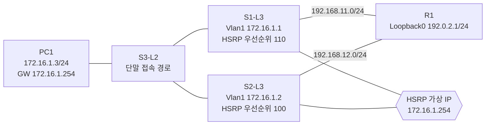

# HSRP 게이트웨이 이중화 및 MHSRP 확장 실습

> **기준 완료본:** 단일 VLAN HSRP 장애 전환·복구 검증 완료  
> **현재 브랜치:** VLAN별 Active를 분산하는 MHSRP 확장 및 장애·복구 검증 완료

GNS3 Cisco IOS 환경에서 두 L3 스위치가 가상 기본 게이트웨이를 제공하도록 구현한 FHRP 실습입니다. HSRP 선출만 확인하지 않고, 상단 링크 장애 시 **HSRP 역할·RIPv2 반환 경로·단말 통신**이 함께 전환되는지 검증했습니다.

- [`portfolio/hsrp-baseline`](../../tree/portfolio/hsrp-baseline): 단일 VLAN HSRP 기준 구현
- [`feat/mhsrp-vlan-expansion`](../../tree/feat/mhsrp-vlan-expansion): 현재 브랜치. VLAN 10/20 MHSRP 확장

## MHSRP 확장 구성

| VLAN | 대표 단말 | 가상 게이트웨이 | 정상 상태 Active | R1 정상 반환 경로 |
| --- | --- | --- | --- | --- |
| VLAN 10 | PC10-USER `172.16.10.3/24` | `172.16.10.254` | S1-L3 | S1 `192.168.11.1`, metric 1 |
| VLAN 20 | PC20-USER `172.16.20.3/24` | `172.16.20.254` | S2-L3 | S2 `192.168.12.2`, metric 1 |

S3-L2는 S1/S2와 `dot1q` 트렁크 2개로 연결되고, VLAN 10과 VLAN 20의 단말 포트는 각각 access 포트로 구성됩니다. 따라서 단말은 VLAN별 가상 기본 게이트웨이를 유지하면서, 정상 시에는 두 L3 스위치로 트래픽이 분산됩니다.

### HSRP 그룹 번호에 대한 기록

초기 설계는 VLAN 10에 HSRP group 10을 사용했습니다. 그러나 이 IOS/GNS3 조합에서는 SVI와 HSRP 선출이 정상임에도 group 10 가상 MAC 응답이 불안정했습니다. VLAN 10은 이미 검증된 **HSRP group 1**로 변경했고, VLAN 20은 group 20을 유지했습니다.

HSRP 그룹 번호와 VLAN 번호는 같을 필요가 없습니다. VLAN과 가상 IP의 연결은 설정에서 명시됩니다. 이는 일반 Cisco 장비의 제약이라고 주장하는 것이 아니라, 이 에뮬레이션 환경에서 확인된 호환성 판단입니다.

### MHSRP 검증 결과

| 검증 항목 | 실제 결과 | 상태 |
| --- | --- | --- |
| 정상 선출 | VLAN 10: S1 Active / S2 Standby, VLAN 20: S2 Active / S1 Standby | 성공 |
| 단말 통신 | PC10·PC20 모두 자신의 가상 게이트웨이와 R1 Loopback0에 도달 | 성공 |
| 정상 반환 경로 | R1은 `172.16.10.0/24`에 S1, `172.16.20.0/24`에 S2를 선택, 모두 metric 1 | 성공 |
| S1 uplink 장애 | S1 Fa1/11 down 시 두 그룹 모두 S2가 Active | 성공 |
| VLAN 10 반환 경로 전환 | R1이 S2 `192.168.12.2`, metric 6으로 전환 | 성공 |
| 복구 | S1은 VLAN 10만 preempt하여 Active 복귀, VLAN 20은 S2 Active 유지 | 성공 |

## 기준 HSRP 토폴로지



| 구성 요소 | 구현 설정 |
| --- | --- |
| PC1 | `172.16.1.3/24`, 기본 게이트웨이 `172.16.1.254` |
| HSRP group 1 | 가상 IP `172.16.1.254`, S1 우선순위 110 및 `preempt` |
| 상단 연결 | S1-R1 `192.168.11.0/24`, S2-R1 `192.168.12.0/24` |
| 도달성 검증 대상 | R1 Loopback0 `192.0.2.1/24` |
| 라우팅 | RIPv2, no auto-summary, 실습용 5/15/15/20 수렴 타이머 |
| 장애 추적 | S1 Fa1/11 추적(20 감쇠), S2 Fa1/12 추적(30 감쇠) |
| 반환 경로 우선순위 | S2가 사용자 서브넷을 R1에 RIP offset metric +5로 광고 |

## 왜 이 설계인가?

일반 호스트는 하나의 기본 게이트웨이를 사용합니다. 장애 시 각 호스트의 게이트웨이를 수동으로 교체하는 방식은 운영에 적합하지 않습니다. HSRP는 가상 IP와 가상 MAC을 유지한 채 Active 장비만 전환합니다.

| 대안 | 장점·한계 | 판단 |
| --- | --- | --- |
| 단일 게이트웨이 | 가장 단순하지만 단일 장애점 발생 | 선택하지 않음 |
| 호스트별 보조 게이트웨이 | FHRP 없이 가능하지만 단말별 변경과 복구 지연 발생 | 선택하지 않음 |
| VRRP | 개방 표준이지만 플랫폼별 지원·동작 차이 존재 | 비교 대안 |
| GLBP | 부하 분산 가능하지만 현재 장애 복구 학습 범위보다 복잡 | 선택하지 않음 |
| HSRP | Cisco IOS에서 Active/Standby 동작을 명확히 검증 가능 | **선택** |

HSRP는 첫 번째 홉만 보호합니다. Active 장비가 살아 있어도 상단 연결을 잃을 수 있으므로, 이 실습은 uplink 추적과 RIP 반환 경로 우선순위를 함께 구성했습니다.

RIP 타이머 `5/15/15/20`은 장애 수렴을 관찰하기 위한 **실습 환경의 선택**입니다. 운영 환경에 그대로 적용해서는 안 되며, 실제 환경에서는 장애 탐지 방식과 안정성을 별도로 검토해야 합니다.

## 단일 HSRP 기준 검증 결과

| 시나리오 | 실제 결과 | 상태 |
| --- | --- | --- |
| 정상 선출 | S1 Active(110), S2 Standby(100) | 성공 |
| 정상 반환 경로 | R1이 S1 `192.168.11.1`, RIP metric 1 선택 | 성공 |
| 가상 게이트웨이 | PC1 → `172.16.1.254`: 5/5 응답 | 성공 |
| 상단 도달성 | PC1 → `192.0.2.1`: 수렴 후 5/5 응답 | 성공 |
| S1 uplink 장애 | S1 유효 우선순위 90, S2 Active 전환 | 성공 |
| 반환 경로 장애 전환 | R1이 S2 `192.168.12.2`, metric 6 선택 | 성공 |
| 복구 | S1 preempt Active 복귀, R1은 S1 metric 1로 복귀 | 성공 |

복구 직후 원격 ping 1건의 손실이 관찰됐습니다. 이를 무손실이라고 과장하지 않고, HSRP·RIP 제어 영역 수렴 중 발생한 실제 결과로 기록했습니다. 이후 5회 ping은 5/5 성공했습니다.

## 다음 확장 후보

1. STP 루트와 HSRP Active 역할을 VLAN별로 정렬합니다.
2. access 링크 한 개의 장애와 트렁크 장애를 검증합니다.
3. RIP 대신 OSPF를 사용했을 때 수렴 시간과 운영성을 비교합니다.
4. 모니터링 항목(HSRP 상태, uplink, STP, end-to-end reachability)을 정의합니다.

## 저장소 구조

```text
.
├── topology/       # GNS3 프로젝트 정의
├── configs/        # 기준 HSRP startup-config
├── configs/mhsrp/  # MHSRP 확장 startup-config 및 VPCS 설정
├── docs/           # 설계 결정과 구현 기록
└── verification/   # 검증 명령과 결과
```

## 로컬 실행 방법

1. 로컬 라이선스가 있는 Cisco IOS L3 스위치·라우터 템플릿을 GNS3에 등록합니다. IOS 이미지는 저장소에 포함하지 않습니다.
2. 기준 구성은 `topology/20260904-1.gns3`, MHSRP 확장 구성은 `topology/mhsrp-vlan-expansion.gns3`를 엽니다.
3. 로컬 템플릿 ID가 다르면 해당 템플릿을 매핑합니다.
4. 장비를 시작한 뒤 [검증 기록](verification/README.md)의 명령으로 상태를 확인합니다.
