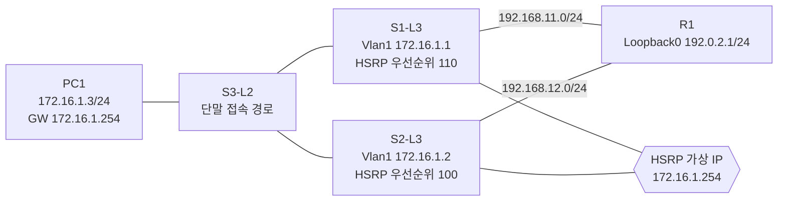

# HSRP 게이트웨이 이중화 기본 실습

> **상태: 단일 VLAN HSRP 구현 및 장애 전환·복구 검증 완료**

GNS3 Cisco IOS 환경에서 두 L3 스위치가 하나의 가상 기본 게이트웨이를 제공하도록 구현한 FHRP 실습입니다. HSRP 선출만 확인하지 않고, 상단 링크 장애 시 **HSRP 역할·RIPv2 반환 경로·클라이언트 통신**이 함께 전환되는지 검증했습니다.

이 브랜치는 **단일 HSRP 그룹(VLAN 1)** 기준 구현을 보존합니다. VLAN별 Active를 분산하는 MHSRP 확장은 [`feat/mhsrp-vlan-expansion`](../../tree/feat/mhsrp-vlan-expansion) 브랜치에서 별도로 관리합니다.

## 토폴로지



| 구성 요소 | 구현 설정 |
| --- | --- |
| PC1 | `172.16.1.3/24`, 기본 게이트웨이 `172.16.1.254` |
| HSRP group 1 | 가상 IP `172.16.1.254`, S1 우선순위 110 및 `preempt` |
| 상단 연결 | S1-R1 `192.168.11.0/24`, S2-R1 `192.168.12.0/24` |
| 도달성 검증 대상 | R1 Loopback0 `192.0.2.1/24` |
| 라우팅 | RIPv2, no auto-summary, 실습용 5/15/15/20 수렴 타이머 |
| 장애 추적 | S1 Fa1/11 추적(20 감쇠), S2 Fa1/12 추적(30 감쇠) |
| 반환 경로 우선순위 | S2가 사용자 서브넷을 R1에 RIP offset metric +5로 광고 |

## 왜 HSRP인가?

일반 호스트는 하나의 기본 게이트웨이를 사용합니다. 장애 시 각 호스트의 게이트웨이를 수동으로 교체하는 방식은 운영에 적합하지 않습니다. HSRP는 가상 IP와 가상 MAC을 유지한 채 Active 장비만 전환합니다.

| 대안 | 장점·한계 | 판단 |
| --- | --- | --- |
| 단일 게이트웨이 | 가장 단순하지만 단일 장애점 발생 | 선택하지 않음 |
| 호스트별 보조 게이트웨이 | FHRP 없이 가능하지만 단말별 변경과 복구 지연 발생 | 선택하지 않음 |
| VRRP | 개방 표준이지만 플랫폼별 지원·동작 차이 존재 | 비교 대안 |
| GLBP | 부하 분산 가능하지만 현재 장애 복구 학습 범위보다 복잡 | 선택하지 않음 |
| HSRP | Cisco IOS에서 Active/Standby 동작을 명확히 검증 가능 | **선택** |

HSRP는 첫 번째 홉만 보호합니다. Active 장비가 살아 있어도 상단 연결을 잃을 수 있으므로, 이 실습은 uplink 추적과 RIP 반환 경로 우선순위를 함께 구성했습니다.

RIP 타이머 `5/15/15/20`은 장애 수렴을 관찰하기 위한 **실습 환경의 선택**입니다. 운영 환경에 그대로 적용해서는 안 되며, 실제 환경에서는 장애 탐지 방식과 안정성을 별도로 검토해야 합니다.

## 실제 검증 결과

| 시나리오 | 실제 결과 | 상태 |
| --- | --- | --- |
| 정상 선출 | S1 Active(110), S2 Standby(100) | 성공 |
| 정상 반환 경로 | R1이 S1 `192.168.11.1`, RIP metric 1 선택 | 성공 |
| 가상 게이트웨이 | PC1 → `172.16.1.254`: 5/5 응답 | 성공 |
| 상단 도달성 | PC1 → `192.0.2.1`: 수렴 후 5/5 응답 | 성공 |
| S1 uplink 장애 | S1 유효 우선순위 90, S2 Active 전환 | 성공 |
| 반환 경로 장애 전환 | R1이 S2 `192.168.12.2`, metric 6 선택 | 성공 |
| 복구 | S1 preempt Active 복귀, R1은 S1 metric 1로 복귀 | 성공 |

복구 직후 원격 ping 1건의 손실이 관찰됐습니다. 이를 무손실이라고 과장하지 않고, HSRP·RIP 제어 영역 수렴 중 발생한 실제 결과로 기록했습니다. 이후 5회 ping은 5/5 성공했습니다.

## 확장 방향

1. 사용자 트래픽을 VLAN 1에서 명시적 사용자 VLAN으로 분리합니다.
2. VLAN별 SVI·HSRP 그룹·가상 IP를 추가합니다.
3. S1과 S2가 VLAN별로 Active 역할을 나누는 MHSRP를 구성합니다.
4. 트렁크·access 포트 정책과 STP 루트를 정렬합니다.
5. access 링크·게이트웨이·상단 링크 장애를 각각 검증합니다.

## 저장소 구조

```text
.
├── topology/       # GNS3 프로젝트 정의
├── configs/        # S1-L3, S2-L3, R1, PC1 startup-config
├── docs/           # 설계 결정과 구현 기록
└── verification/   # 검증 명령과 실제 결과
```

## 로컬 실행 방법

1. 로컬 라이선스가 있는 Cisco IOS L3 스위치·라우터 템플릿을 GNS3에 등록합니다. IOS 이미지는 저장소에 포함하지 않습니다.
2. `topology/20260904-1.gns3`를 열고, 로컬 템플릿 ID가 다르면 해당 템플릿을 매핑합니다.
3. 모든 장비를 시작한 뒤 [검증 기록](verification/README.md)의 명령으로 상태를 확인합니다.
4. 다중 VLAN MHSRP는 기능 브랜치에서 별도 확장으로 수행합니다.
