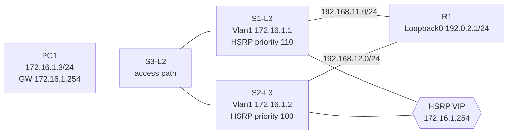

# HSRP First-Hop Redundancy Foundation Lab

> **Baseline status: single-VLAN HSRP implementation and failure recovery verified.**

GNS3 Cisco IOS 환경에서 두 L3 스위치가 하나의 가상 기본 게이트웨이를 제공하도록 구현한 FHRP 실습입니다. 단순히 HSRP 선출만 확인하지 않고, 상단 링크 장애가 발생했을 때 **HSRP 역할, RIPv2 반환 경로, 클라이언트 통신**이 함께 전환되는지 검증했습니다.

`portfolio/hsrp-baseline` 브랜치는 위 단일 HSRP 검증본을 보존합니다. 현재 `feat/mhsrp-vlan-expansion` 브랜치는 VLAN별 Active를 나누는 **MHSRP 확장 구현 및 장애·복구 검증**을 추가합니다.

## MHSRP expansion — `feat/mhsrp-vlan-expansion`

| VLAN | Representative client | Virtual IP | Active in normal state | Preferred R1 return path |
| --- | --- | --- | --- | --- |
| VLAN 10 | PC10-USER `172.16.10.3/24` | `172.16.10.254` | S1-L3 | S1 `192.168.11.1`, metric 1 |
| VLAN 20 | PC20-USER `172.16.20.3/24` | `172.16.20.254` | S2-L3 | S2 `192.168.12.2`, metric 1 |

S3-L2 uses two `dot1q` uplinks to S1/S2 and access ports for VLAN 10 and VLAN 20. Each client keeps a VLAN-local virtual default gateway while normal traffic is distributed across the two L3 switches.

The original plan used HSRP group 10 for VLAN 10. In this IOS/GNS3 combination, the group-10 virtual MAC responded inconsistently although both SVIs and HSRP election were healthy. VLAN 10 therefore uses the previously verified **HSRP group 1**, while VLAN 20 uses group 20. Group number and VLAN number do not need to match; the IP/VLAN association is explicit in the configuration. This is recorded as an emulator-specific compatibility decision, not a claim of a general Cisco limitation.

### MHSRP verification

| Test | Observed result | Status |
| --- | --- | --- |
| Normal election | VLAN 10: S1 Active / S2 Standby; VLAN 20: S2 Active / S1 Standby | pass |
| Client reachability | PC10 and PC20 each reached its virtual gateway and R1 Loopback0 | pass |
| Normal return routing | R1 selected S1 for `172.16.10.0/24` and S2 for `172.16.20.0/24`, both metric 1 | pass |
| S1 uplink fault | S1 Fa1/11 down: S1 became Standby for both groups; S2 became Active for both groups | pass |
| VLAN 10 return failover | R1 selected S2 `192.168.12.2`, metric 6 | pass |
| Recovery | S1 preempted back to VLAN 10 Active; VLAN 20 remained S2 Active | pass |

## Topology



| Component | Implemented configuration |
| --- | --- |
| PC1 | `172.16.1.3/24`, default gateway `172.16.1.254` |
| HSRP group 1 | virtual IP `172.16.1.254`; S1 priority 110 and `preempt` |
| Upstream | S1-R1 `192.168.11.0/24`, S2-R1 `192.168.12.0/24` |
| Reachability target | R1 Loopback0 `192.0.2.1/24` |
| Routing | RIPv2, no auto-summary; 5/15/15/20 lab convergence timers |
| Failure tracking | S1 tracks Fa1/11 (decrement 20); S2 tracks Fa1/12 (decrement 30) |
| Return-path preference | S2 advertises the user subnet to R1 with RIP offset metric +5 |

## Why this design?

Hosts normally use one default gateway. Replacing it device-by-device during an outage is not operationally acceptable. HSRP keeps the host gateway address and virtual MAC stable while the active L3 switch changes.

| Alternative | Trade-off | Decision |
| --- | --- | --- |
| Single gateway | simplest but creates a single point of failure | not selected |
| Static backup gateway on clients | requires endpoint changes and has slow/manual recovery | not selected |
| VRRP | open standard, but behaviour and commands differ by platform | comparison option |
| GLBP | adds load distribution, beyond this failure-recovery objective | not selected |
| HSRP | clear active/standby model supported by the Cisco IOS lab image | **selected** |

HSRP alone protects only the first hop. The active device can remain reachable from the client while its upstream link is lost. Therefore this lab also tracks the uplink and makes R1 prefer S1 normally but use S2 after S1's path is invalidated.

The shortened RIP timers are a **lab decision** to make convergence observable in a practical test window. They should not be copied to production unchanged; production timer values require failure-detection and stability analysis.

## Verified results

| Scenario | Observed result | Status |
| --- | --- | --- |
| Normal election | S1 Active (priority 110), S2 Standby (priority 100) | pass |
| Normal return path | R1 chose S1 `192.168.11.1`, RIP metric 1 | pass |
| Virtual gateway test | PC1 -> `172.16.1.254`: 5/5 replies | pass |
| Upstream test | PC1 -> `192.0.2.1`: stable 5/5 replies after convergence | pass |
| S1 uplink fault | Shut S1 Fa1/11: S1 effective priority became 90, S2 became Active | pass |
| Return-path failover | R1 changed to S2 `192.168.12.2`, RIP metric 6 | pass |
| Recovery | Restore Fa1/11: S1 preempted to Active; S2 returned Standby; R1 returned to metric 1 via S1 | pass |

One remote ping was lost immediately after recovery while the control plane reconverged. This is recorded as measured behavior, not hidden as a zero-loss claim. The subsequent 5-packet test was 5/5 successful.

## Scope boundary and next iteration

This is not MHSRP yet. The next, separately testable extension is:

1. Replace user traffic on VLAN 1 with explicit user VLANs.
2. Add an HSRP group and virtual IP per VLAN.
3. Make S1 Active for one VLAN and S2 Active for another (MHSRP).
4. Add trunk/access policy and STP root alignment.
5. Repeat access-link, active-gateway, and upstream-failure tests.

## Repository layout

```text
.
├── topology/       # GNS3 project definition
├── configs/        # saved startup snapshots for S1-L3, S2-L3, R1, and PC1
├── docs/           # design rationale and implementation record
└── verification/   # exact commands and observed results
```

## Run it locally

1. Import locally licensed Cisco IOS L3-switch/router templates into GNS3. IOS images are deliberately not distributed.
2. Open `topology/20260904-1.gns3` and map templates if your local template IDs differ.
3. Start all nodes and consult [verification/README.md](verification/README.md).
4. Treat the saved configurations as the tested baseline; perform MHSRP only as a separate expansion.
